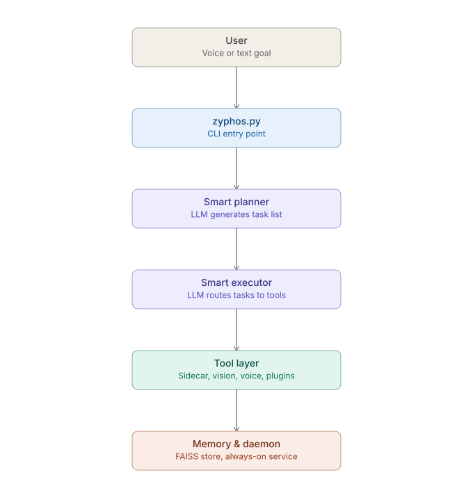
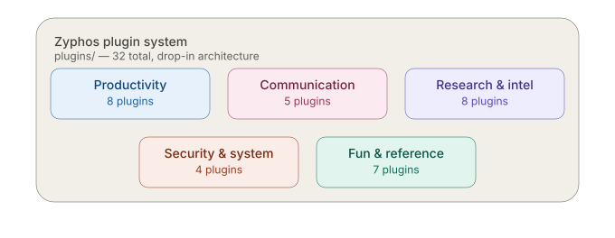

# Z.Y.P.H.O.S
### Zero-dependency Yield-driven Predictive Heuristic Operating System

> *An autonomous AI operating layer — built to operate like Jarvis.*

[](https://www.python.org/)
[]()
[]()
[]()

---

## What is Zyphos?

Zyphos is a fully autonomous AI operating system built from scratch. It sits between large language models and your computer, understanding goals in plain English and executing them — controlling your screen, managing files, browsing the web, sending messages, playing music, and more.

Give it a goal. It figures out the rest.

```bash
python zyphos.py "search for the latest AI news and brief me on it"
python zyphos.py "send a WhatsApp message to Mom saying I'll be late"
python zyphos.py "what asteroids are passing Earth today"
python zyphos.py --listen   # speak your goal instead
```

It is not a chatbot. It is not a wrapper around an API. It is infrastructure.

---

## Why I built this

I wanted an AI that doesn't just answer questions — one that actually does things on my computer, remembers what it did, and gets smarter the more I use it. Every LLM demo I saw was a chat window. Zyphos is the opposite: a background layer that plans, executes, watches, and speaks, with the chat window being optional.

---

## Demo

[](https://asciinema.org/a/sTehVol512yDDYSN)

*Watch Zyphos search for news and speak a summary, tell a joke, and run a multi-round autonomous research task — all in real time.*

---

## Architecture

Zyphos runs entirely on your machine — no cloud dependency for core execution.



```
User (voice/text)
      ↓
  zyphos.py          ← CLI entry point
      ↓
Smart Planner        ← LLM generates task list from natural language
      ↓
Smart Executor       ← LLM routes each task to the correct tool
      ↓
 Tool Layer
 ├── Sidecar         ← Controls Windows (click, type, screenshot, scroll)
 ├── Vision          ← Groq vision API — sees and describes the screen
 ├── STT             ← Whisper — speech to text
 ├── TTS             ← Edge TTS (en-GB-RyanNeural) — speaks responses
 ├── Search          ← DuckDuckGo web search
 ├── Filesystem      ← Read, write, organize files
 ├── Shell           ← Execute bash commands
 └── Plugins         ← Drop-in extensions (25+ and growing)
      ↓
  Memory             ← FAISS vector store — remembers everything
      ↓
 Daemon              ← Always-on background service
```

---

## Feature Matrix

| Feature | Status | Backend |
|---|---|---|
| LLM planning + execution | ✅ | Cerebras gpt-oss-120b (default) |
| Fallback LLM | ✅ | Gemini 3.5 Flash / Groq Llama 3.3 70B |
| Local LLM (offline) | ✅ | Ollama — Hermes3 3B |
| Self-critique loop | ✅ | Cerebras |
| Goal chaining | ✅ | Cerebras |
| Semantic memory | ✅ | FAISS + all-MiniLM-L6-v2 |
| Speech recognition | ✅ | Whisper small (confidence threshold 0.4) |
| Voice synthesis | ✅ | Edge TTS — en-GB-RyanNeural |
| Voice biometrics | ✅ | Resemblyzer (cosine sim threshold 0.70) |
| Screen vision | ✅ | Groq — llama-4-scout-17b |
| Web search | ✅ | DuckDuckGo (ddgs) |
| GUI automation | ✅ | Windows sidecar (pyautogui) |
| Plugin system | ✅ | 25 built-in, drop-in architecture |
| Always-on daemon | ✅ | Background process + PID management |
| Auto-restart watchdog | ✅ | 30s interval check |
| Web dashboard | ✅ | Flask — localhost:6789 |
| TUI monitor | ✅ | Rich |
| Scheduling | ✅ | Interval + time-based |
| User profile awareness | ✅ | Injected into every LLM call |

---

## LLM Backends

Zyphos supports multiple LLM backends with automatic fallback:

| Backend | Model | Speed | Notes |
|---|---|---|---|
| **Cerebras** (default) | gpt-oss-120b | ~1s | Cloud, free tier |
| **Gemini** | gemini-3.5-flash | ~2s | Cloud, free tier |
| **Groq** | llama-3.3-70b-versatile | ~2s | Cloud, free tier |
| **Ollama** (local) | hermes3:3b | ~5s | Fully offline |

Switch via `ZYPHOS_BACKEND` env var or `.env` file.

---

## Plugins (34+)



| Plugin | Capability |
|--------|-----------|
| calendar | Google Calendar — list, add, view today's events |
| gmail | Send, read, search Gmail |
| drive | List, upload, download, search Google Drive |
| whatsapp | Send WhatsApp messages via WhatsApp Web |
| whatsapp_bulk | Send same message to multiple contacts |
| music | Play/stop music via yt-dlp + VLC |
| youtube | Search and open YouTube in browser |
| weather | Current weather via OpenWeatherMap |
| notes | Personal note manager |
| timer | Countdown timer with TTS alert |
| system_stats | CPU, RAM, disk, battery status |
| clipboard | Read/write Windows clipboard |
| file_organizer | Sort files by type into subfolders |
| network_scan | Ping sweep, device discovery |
| security | Password gen, IP lookup, DNS, WHOIS, WiFi info |
| port_scanner | Threaded port scanner |
| joke | Random jokes via JokeAPI |
| nasa | APOD, asteroids, Earth photos, solar flares, natural events |
| news | Headlines by topic via NewsAPI |
| countries | Country info via Wikipedia |
| github_stats | Repo stats and recent commits — works on any public repo |
| github_clone | Clone or zip-download any public GitHub repo |
| spotify | Spotify control (Premium required) |
| calculator | Evaluate math expressions |
| dictionary | Word definitions and lookups |
| translate | Translate text via Cerebras, auto-speaks result |
| qr | Generate QR codes |
| wigolo | ML-reranked web search, page fetch, multi-step research |
| webintel | Read webpages (Jina Reader), YouTube transcripts, semantic search, RSS |
| wisdom | Philosophical quotes and two-voice Socratic dialogues |
| briefing | Daily spoken briefing — weather, calendar, and news combined |
| pdf_summary | Read and summarize PDF documents |
| ocr | Extract text from screen regions (full/left/right) or image files |
| hello | Example plugin template |

### Monitoring
- **TUI Monitor** — rich terminal dashboard (`python scripts/monitor.py`)
- **Web UI** — browser dashboard at `localhost:6789` (`python scripts/webui.py`)
- **Watchdog** — auto-restarts daemon if it crashes

---

## Project Structure

```
~/zyp/
├── core/
│   ├── daemon.py           — always-on background service
│   ├── executor.py         — keyword task executor
│   ├── smart_executor.py   — LLM-based tool router
│   ├── smart_planner.py    — LLM task planner
│   ├── planner.py          — keyword task planner
│   ├── chainer.py          — goal chaining
│   ├── critic.py           — self-critique loop
│   ├── llm.py              — multi-backend LLM router
│   ├── plugin_loader.py    — auto-loads plugins/
│   ├── scheduler.py        — time/interval scheduling
│   ├── voice_auth.py       — voice biometric authentication
│   └── explainer.py        — self-awareness module (--explain)
├── tools/
│   ├── sidecar.py          — Windows control + TTS via Edge TTS
│   ├── vision.py           — screen/webcam vision
│   ├── stt.py               — speech to text
│   ├── search.py            — web search
│   ├── filesystem.py       — file operations
│   └── shell.py             — bash execution
├── memory/
│   └── store.py             — FAISS vector memory
├── plugins/                 — drop .py files here to add tools
├── scripts/
│   ├── monitor.py           — TUI dashboard
│   ├── webui.py             — web dashboard
│   ├── watchdog.py          — daemon watchdog
│   └── briefing.py          — daily spoken briefing
├── state/                   — runtime state (gitignored)
├── logs/                    — logs (gitignored)
├── zyphos.py                — main entry point
└── requirements.txt
```

---

## Getting Started

### Prerequisites
- Windows 10/11 with WSL2 (Ubuntu 22.04)
- Python 3.10+
- Ollama (for local LLM) OR a free Cerebras API key

### Installation

```bash
# Clone the repo
git clone https://github.com/Tejas13062035/ZYPHOS-Z.Y.P.H.OS.git ~/zyp
cd ~/zyp

# Create and activate virtual environment
python3 -m venv venv
source venv/bin/activate

# Install dependencies
pip install -r requirements.txt

# Set up environment variables
cp .env.example .env
nano .env  # add your API keys
```

### Windows Sidecar Setup
```bash
# On Windows, run the sidecar before using Zyphos
python C:\zyphos_sidecar\sidecar.py
```

### Environment Variables

```env
CEREBRAS_API_KEY=your_key      # free at inference.cerebras.ai
GEMINI_API_KEY=your_key        # free at aistudio.google.com
GROQ_API_KEY=your_key          # free at console.groq.com
OPENWEATHER_API_KEY=your_key   # free at openweathermap.org
NEWS_API_KEY=your_key          # free at newsapi.org
NASA_API_KEY=your_key          # free at api.nasa.gov
GITHUB_TOKEN=your_token        # github.com/settings/tokens
```

### Run Zyphos

```bash
# Single goal
python zyphos.py "your goal here"

# Multiple goals
python zyphos.py "goal 1" "goal 2"

# Voice input
python zyphos.py --listen

# Start always-on daemon
python zyphos.py --daemon

# Send goal to running daemon
python zyphos.py --send "your goal"

# Web UI
python scripts/webui.py  # open localhost:6789

# Daily briefing
python zyphos.py --briefing
```

---

## CLI Reference

| Command | Description |
|---------|-------------|
| `python zyphos.py "goal"` | Execute a goal |
| `python zyphos.py "g1" "g2"` | Execute multiple goals |
| `--listen` | Voice input mode |
| `--enroll` | Enroll voice for biometric auth |
| `--send "goal"` | Send goal to running daemon |
| `--daemon` | Start background daemon |
| `--stop` / `--restart` | Stop / restart daemon |
| `--status` | Show daemon status + recent goals |
| `--memory "query"` | Semantic memory search |
| `--research "topic"` | Multi-round autonomous web research |
| `--briefing` | Daily spoken briefing |
| `--explain` | Zyphos explains itself |
| `--schedule "goal" --every 60` | Run goal every 60 seconds |
| `--schedule "goal" --at 14:30` | Run goal at specific time |
| `--watchdog` | Start daemon watchdog |
| `python scripts/monitor.py` | TUI dashboard |
| `python scripts/webui.py` | Web dashboard |

---

## Writing a Plugin

Drop a `.py` file into `plugins/` — no core edits, no registration, nothing else needed.

```python
TOOL_NAME = "my_tool"
TOOL_DESCRIPTION = "What this tool does"
TOOL_ARGS = {"param": "type: description"}

def run(args=None):
    # your code here
    return {"status": "ok", "result": "output"}
```

Zyphos auto-discovers it on next run and makes it available to both the keyword executor and the LLM smart executor.

---

## Roadmap

## Roadmap

See [ROADMAP.md](ROADMAP.md) for the full, up-to-date roadmap — phases completed, near-term plans, what's gated behind the new hardware, and longer-term exploratory ideas.

---

## Hardware

**Current development machine:**
HP Pavilion 15 — i5-8250U, 8GB RAM, Intel Iris Xe (CPU-only)

**Target machine (arriving Jul-Aug 2026):**
HP Victus — Ryzen 7 260, 24GB RAM, RTX 5050 8GB VRAM

---

## Built By

**Tejas** — 19-year-old independent AI researcher and systems builder.
Building Z.Y.P.H.O.S solo since early 2026, toward a fully autonomous personal AI that knows you, watches your environment, and acts before you ask.

---

## License

MIT License — see `LICENSE` for details.

---

*End goal: give it a goal in plain English, it figures out and executes everything.*
